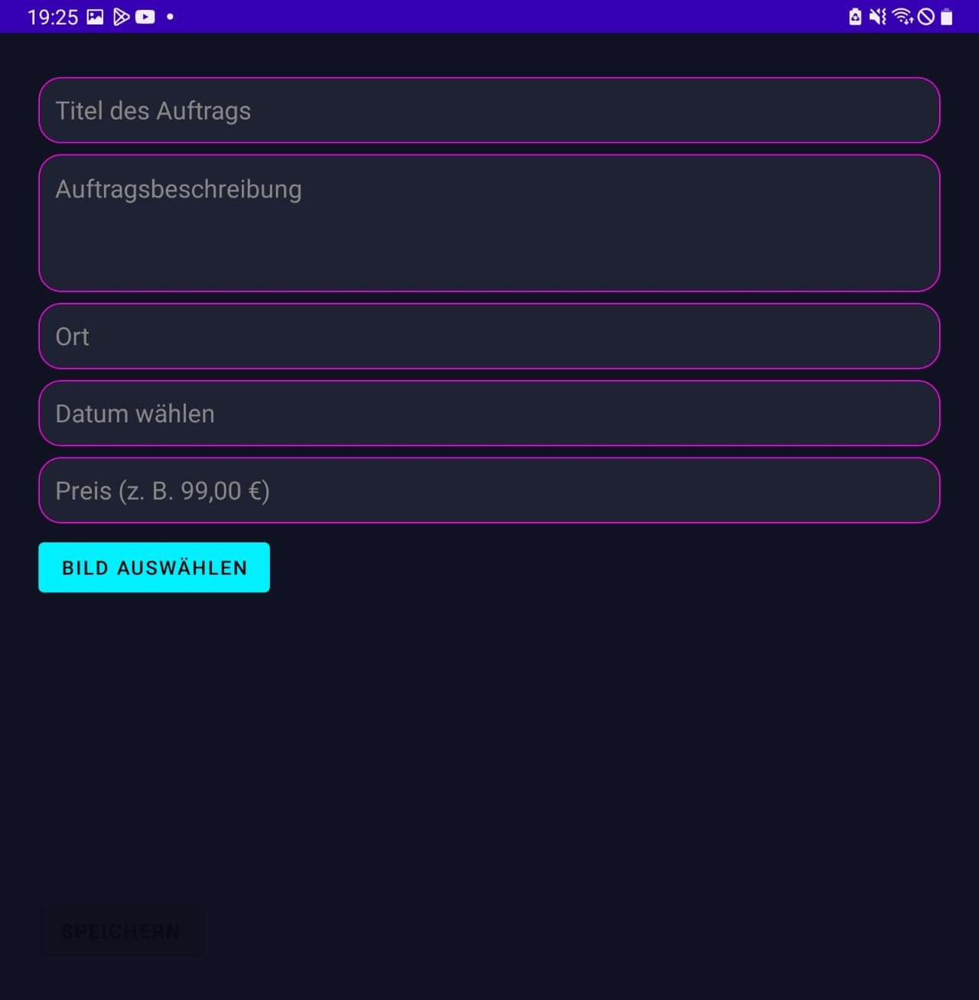
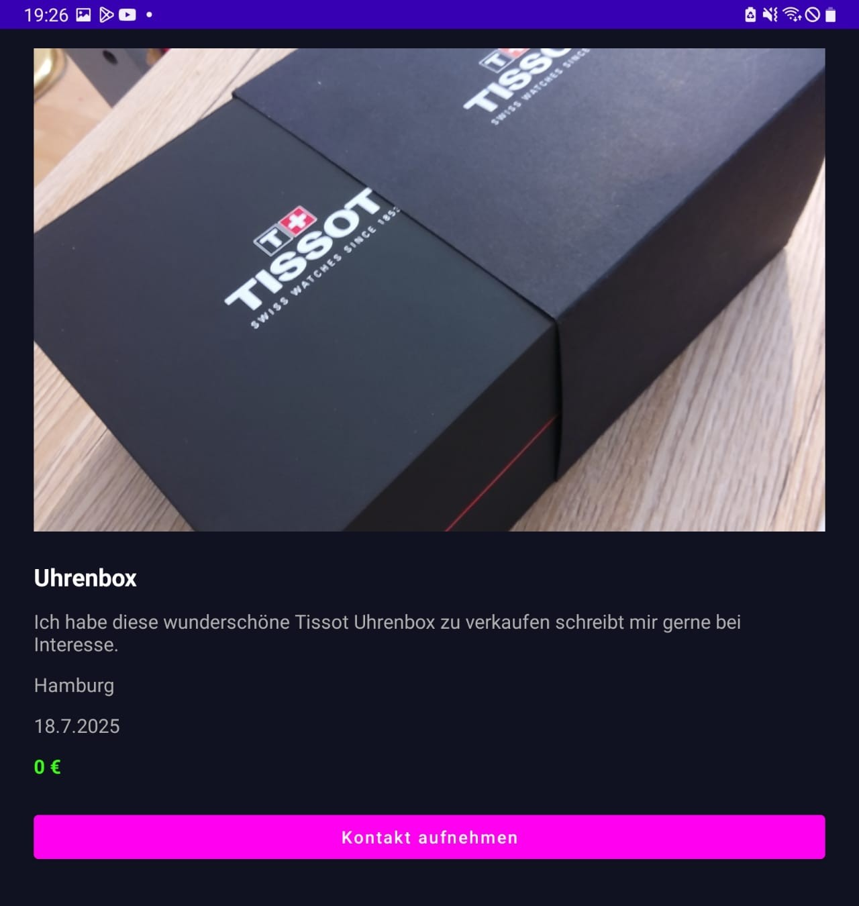
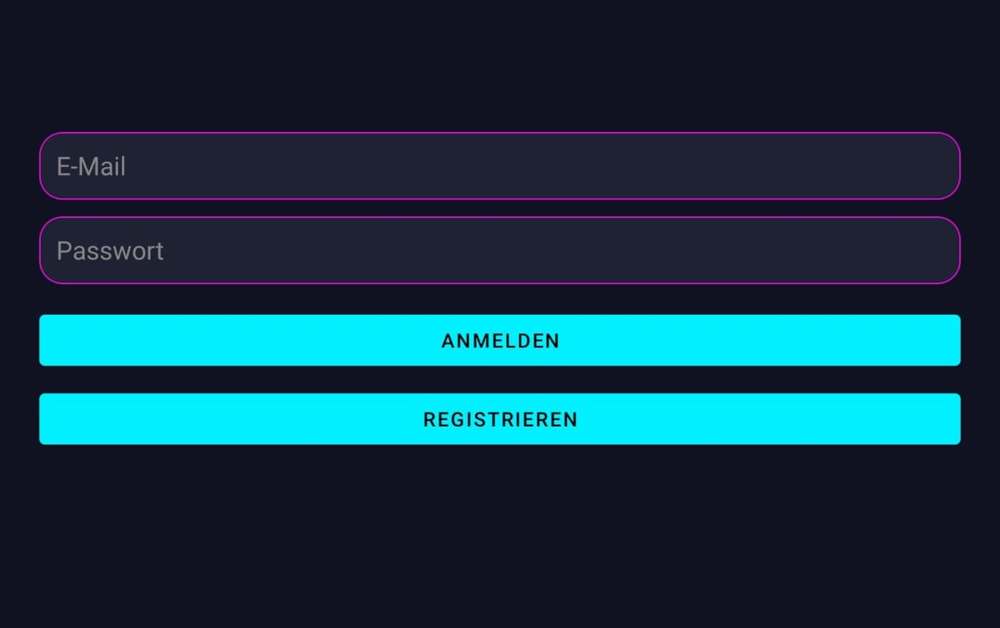

# WOSAssist

**WOSAssist** is an Android application for creating orders. Users can log in and out, create new orders (with image uploads), search for orders, and view a details page. I use Firebase for my backend.

## Demo Video

A short demonstration of the app is available on YouTube:

👉 **[https://youtube.com/shorts/0iee9Bed-s8?feature=share](https://youtube.com/shorts/0iee9Bed-s8?feature=share)**

---

## Features

* User authentication (sign in / sign out)
* Create orders with images 
* Search orders with Letters
* Detailed order pages
* Firebase backend 

## Screenshots

---

## Tech Stack

* Java (Android)
* XML UI Layouts
* Firebase Backend
* Gradle (Kotlin DSL)
* Min / Target SDK customizable

## Build & Run (Developer Setup)

1. Clone the repository.
2. Add your `app/google-services.json` to the `app/` folder (not included in repo).
3. Open the project in Android Studio.
4. Build or run using the Run button or `./gradlew assembleDebug`.

## APK / Demo

A signed or debug APK plus demo recording is available in the GitHub **Releases**.

## Security & Privacy

Sensitive keys like `google-services.json` are **not committed** and must be added manually for testing.
