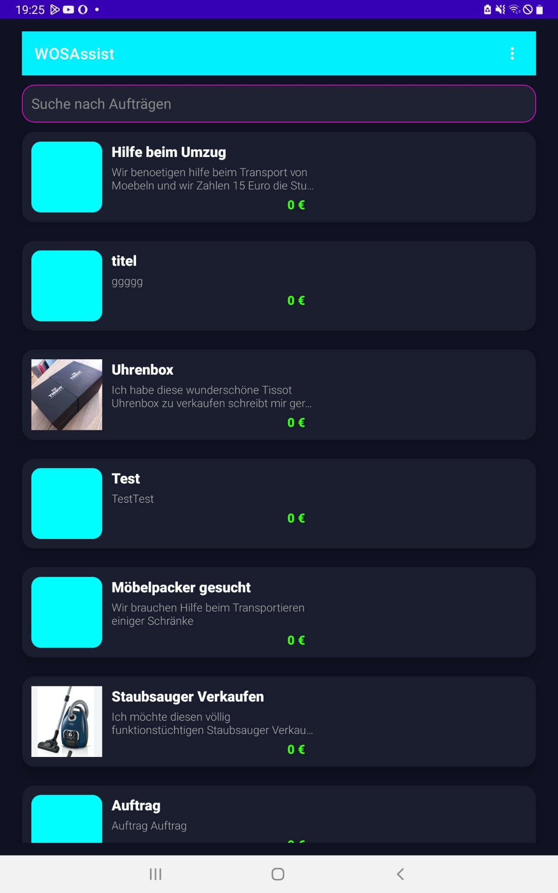

# WOSAssist

**WOSAssist** is an Android application designed to streamline order management. Users can securely sign in and out, create new orders (with image uploads), search for orders, and view order details. The app uses Firebase for authentication and data storage.

## Features
- User authentication (sign in / sign out)
- Create orders with images from device gallery
- Search orders with full-text search
- Order detail pages
- Firebase Realtime/Firestore backend (config excluded from repo)

## Screenshots

> For a short demo video, see the Release assets or the linked unlisted YouTube video.

## Tech Stack
- Java + XML (Android)
- Firebase (Auth + Firestore + Storage)
- Gradle (Kotlin DSL)
- Target: Android SDK XX (specify your min/target SDK)

## Build & Run (developer)
1. Download the project.
2. Add your `app/google-services.json` to `app/` (not committed).
3. Open the project in Android Studio (recommended) or import to your preferred IDE.
4. Run `./gradlew assembleDebug` or build from Android Studio.

## APK / Demo
A signed/debug APK and demo recording can be found in the [Releases](https://github.com/Juveloper/WOSAssist/releases).

## Security & Privacy
`google-services.json` and any API keys are intentionally excluded from the repository. If you want to test, add your own Firebase config to `app/` (do NOT commit it).

## License
This project is licensed under the MIT License — see `LICENSE` for details.

## Contact
Justin Juarez — Juveloper — jujuarez@outlook.de
